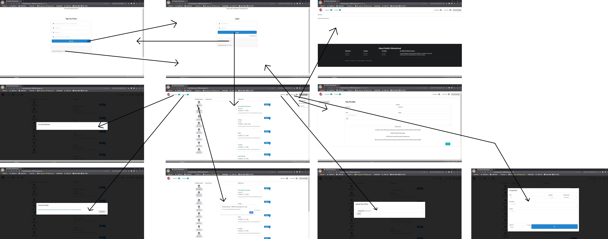

# CMPUT-404-Project

Welcome to the git repository of Hindle's Wonderland. This is a repository of CMPUT 404 project.

## Technologies Used

- Django
- Django Rest Framework
- React
- AJAX
- Git
- Swagger
- Redoc
- Figma

## Online demo

### Frontend (React website)

[http://boiling-bayou-18990.herokuapp.com/](http://boiling-bayou-18990.herokuapp.com/)

**Note:** Currently, this frontend cannot run under HTTPS protocol, please use HTTP to connect.
**Note:** The APIFetcher folder contains Ajax.

### Backend (Django API endpoint)

[https://cmput-404-project.herokuapp.com/](https://cmput-404-project.herokuapp.com/)

Default superuser account:
username: demoadmin
password: demoadmin

### Demo Video

[Youtube](https://www.youtube.com/watch?v=i--kNEMyg2k&feature=youtu.be)

## Frontend Setup

All frontend codes are under `/frontend`. Run the following shell command to start the website server:

```console
cd frontend
npm install
npm start
```

## Backend Setup

All backend codes are under `/api`. Run the following shell command to start the API endpoint:

```console
cd api
pipenv install
pipenv shell
python manage.py makemigrations
python manage.py migrate
python manage.py createsuperuser
python manage.py runserver
```

### How to upgrade an account to "admin" (admin of the host)

Upgrade an account to "admin" can only performed by an existing admin account or a superuser account.
Therefore, for first time upgrading account to "admin", you need a superuser account.

1. Create a superuser account.
2. Log in `https://{host_address}/admin/users/user/` using the created superuser.
3. Select the user and set its userType to "admin".

**Note:** If you are using a Heroku instance, Heroku seems to do not support check user type by "user.is_superuser" (this bug has not been fixed yet). Therefore, rather than update userType field of a user by the update API, please use the admin panel offered by Django.

## API documentation

After running the Django server, you can check out the API documentation at `http://localhost:8000/swagger/` or `http://localhost:8000/redoc/` depending on what kind of documentation UI you prefer.

For the online demo, they should be `https://cmput-404-project.herokuapp.com/swagger/` and `https://cmput-404-project.herokuapp.com/redoc/`.

[Online viewing](https://cmput-404-project.herokuapp.com/swagger/)

## Host Administration

The users and remote hosts administration can be found at `https://{host_address}/admin/users/user/` and `https://{host_address}/admin/hosts/host/`.

For the online demo, they shold be at `https://cmput-404-project.herokuapp.com/admin/users/user/` and `https://cmput-404-project.herokuapp.com/admin/hosts/host/`.

We also offer API endpoints for administration, please see the API documentation.

## Remote Hosts Connection

We wrote a conenction helper which can fetch the data that adhere the example JSON format in the given example-article.json.

The remote hosts can be added or removed easily on the administration page. The baseURL should be the common part of the API endpoint that ending with a slash sign "/" (eg. `https://cmput-404-project.herokuapp.com/api/`).

The two default remote host our online demo connected with are `https://spongebook-develop.herokuapp.com/` and `https://cmput404-socialdistribution.herokuapp.com/`.

## UI Planning

### UI Mockup

This is an early version of UI that we planned before building the frontend.

See the `UI_mockup.fig` under the root directory. 

[Online vewing](https://www.figma.com/file/sKnTrhQ3f2uaiexQ0A8OSJ/CMPUT-404-Project?node-id=6%3A272)

### UI Story Board

This is a story board of the final version of UI. 

If the picture is too small to see, please open it in another tab and zoom in.


